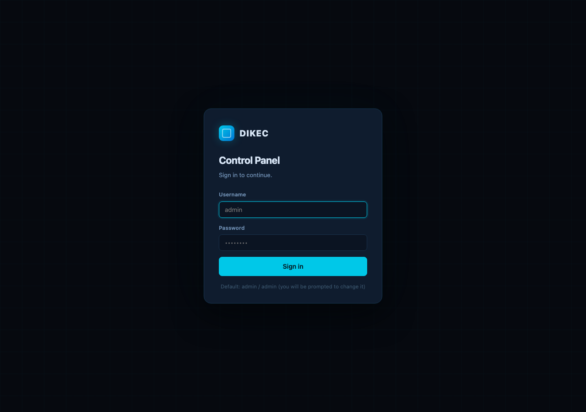
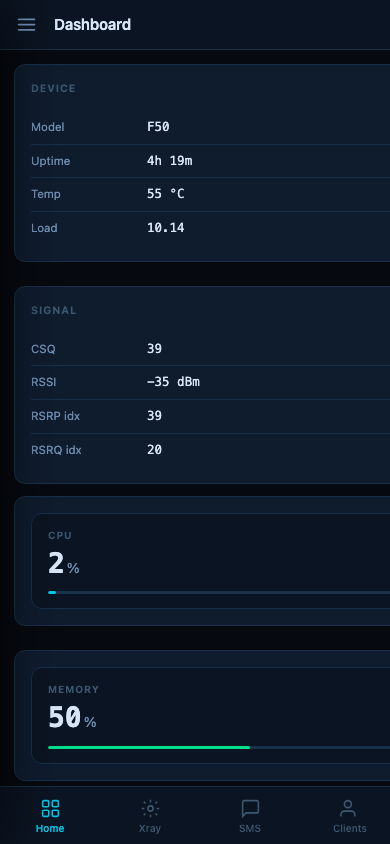
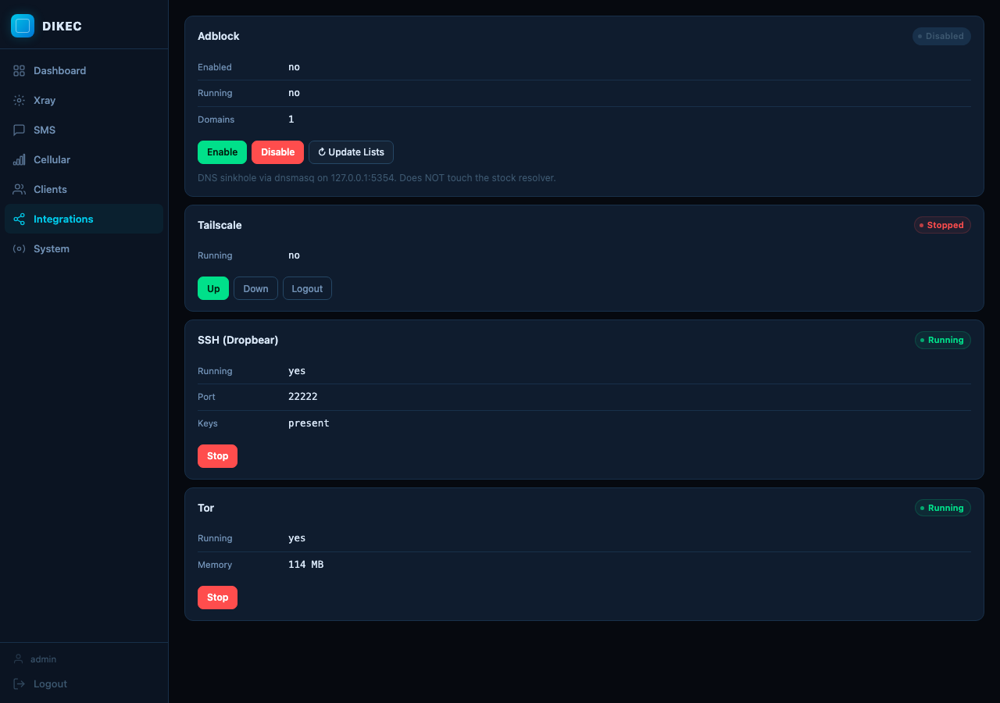
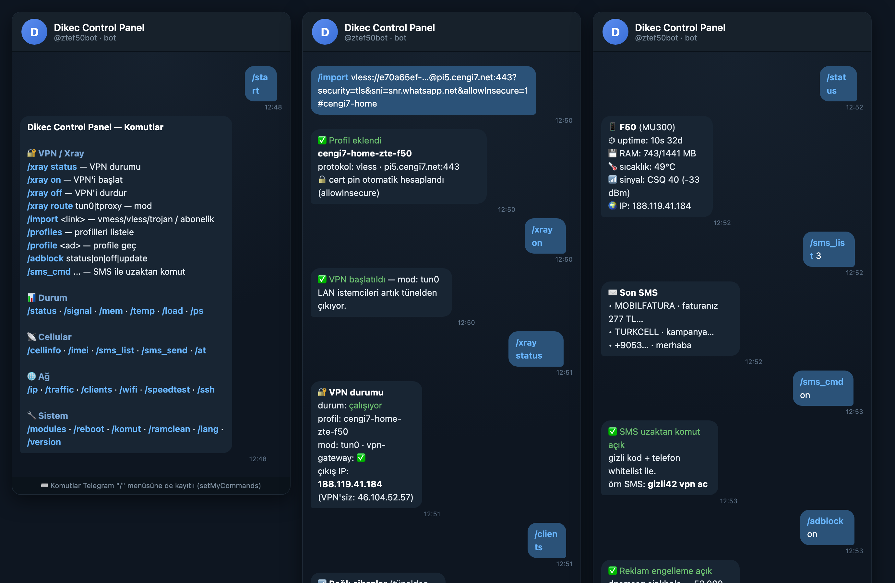

<div align="center">

# Dikec Control Panel

**ZTE F50 / MU300 için xray tabanlı VPN + web panel + Telegram bot + SMS merkezi — hepsi tek ortak backend üzerinde.**

APK/V2rayTun yerine doğrudan **xray binary'leri** ile çalışır. Web paneli, Telegram botu ve SMS komutları aynı `lib/action.sh` çekirdeğini paylaşır — bir özellik eklendiğinde üçünde de çıkar.

</div>

---

## ✨ Özellikler

| | |
|---|---|
| 🔐 **Xray VPN** | vmess / vless / trojan link **ve abonelik URL'si** import; çoklu profil; `tun0` (vpn-gateway uyumlu) veya `tproxy` yönlendirme; **profil hız testi → en hızlıya geç**; `allowInsecure` linkleri için otomatik cert-pin (xray 26.3.27 uyumlu) |
| 🌐 **Web Panel** | Profesyonel, **mobil uyumlu** arayüz; kullanıcı/şifre **login** (ilk girişte zorunlu sıfırlama); localhost veya LAN'a açma |
| 🤖 **Telegram Bot** | 80+ komut (durum, sinyal, hücresel, SMS, dosya, güç/CPU, modül yönetimi…) + VPN/Xray/adblock kontrolü; 12 dil |
| ✉️ **SMS Merkezi** | Gelen kutusu oku/gönder/sil + **SMS ile uzaktan komut** (gizli kod + telefon whitelist + rate-limit) |
| 🚫 **Adblock** | Hafif `dnsmasq` DNS-sinkhole (AdGuard Home yerine, ~1-2 MB); stok DNS'e dokunmaz |
| 📶 **Per-client bypass** | Hotspot cihazlarını tek tek VPN tünelinden çıkarma |
| 🔌 **Entegrasyonlar** | Tailscale / SSH (dropbear) / Tor başlat-durdur-durum |
| ♻️ **Self-update** | `latest.txt` + SHA256 ile kendini güncelleme |

<div align="center">
 
<br>

</div>

---

## 📦 Kurulum

**Gereksinimler:** ZTE F50 / MU300 (Android 13, arm64), **Magisk**, ve [`bin-utils`](https://github.com/dikeckaan/magisk-zte-f50-bin-utils) modülü (bash/busybox/curl/jq/sendat + `lib/common.sh` sağlar).

```sh
# Magisk ile zip'i flash et, ya da bottan:
/install_module dikec-control-panel
```

Kurulumda otomatik: `bin-utils` bağımlılık kontrolü, eski `statusbot` ayarlarının `/data/dikec`'e göçü, statusbot + AdGuard Home'un devre dışı bırakılması.

> Zip üretmek için: `sh tools/build-zip.sh` → `dist/dikec-control-panel-<ver>.zip`

---

## 🌐 Web Panel

Varsayılan olarak yalnızca **localhost**'a (`127.0.0.1:8088`) bağlıdır:

```sh
adb forward tcp:8088 tcp:8088
# Tarayıcı: http://127.0.0.1:8088/
```

- **İlk giriş:** kullanıcı `admin`, şifre `admin` → panel sizi yeni şifre belirlemeye zorlar.
- **LAN'a açma:** System sekmesi → LAN-expose. Açıkken `0.0.0.0:8088`'e bağlanır; login zorunlu kalır.
- **Şifreyi ADB'den sıfırlama** (unutursanız):
  ```sh
  adb shell su -c '/data/adb/modules/dikec-control-panel/lib/action.sh panel_passwd_reset'   # → admin/admin
  adb shell su -c "/data/adb/modules/dikec-control-panel/lib/action.sh panel_passwd 'YeniSifre123'"
  ```

Sekmeler: **Dashboard · Xray · SMS · Cellular · Clients · Integrations · System**.

---

## 🔐 VPN kullanımı

Web panelden (Xray sekmesi) veya bottan, tek adımda — linki yapıştır:

```
/import vless://...           # vmess/vless/trojan linki
/import https://.../sub       # abonelik URL'si (çoklu profil)
/xray on                      # başlat
/xray status                  # çıkış IP'sini gör
/probe switch                 # profilleri test et, en hızlıya geç
```

`tun0` modunda **vpn-gateway** hotspot istemcilerini (`192.168.0.x`) otomatik tünele yönlendirir — bağlı tüm cihazlar VPN sunucusunun IP'sinden çıkar.

---

## 🤖 Telegram Bot

```sh
echo "<BOT_TOKEN>"  > /data/dikec/token      # BotFather'dan
echo "<CHAT_ID>"    > /data/dikec/chat_id     # owner chat_id
```

Bot yalnızca owner'a yanıt verir. Tüm komutlar: **`/help`**. Öne çıkanlar: `/status` `/signal` `/cellinfo` `/sms_list` `/sms_send` `/xray` `/import` `/profiles` `/probe` `/adblock` `/sms_cmd` `/modules` `/reboot` `/komut`.

<div align="center"></div>

---

## ✉️ SMS uzaktan komut

```
/sms_cmd on
/sms_cmd secret gizli42
/sms_cmd allow +90555...
```

Açıkken, whitelist'teki telefondan **`gizli42 vpn ac`** gibi SMS atarak cihazı internet olmadan kontrol edebilirsiniz.

---

## 🏗️ Mimari

```
   Telegram ─► bot/bot.sh ─┐                ┌─ www/cgi-bin/api.cgi ◄─ Web (busybox httpd)
                           ├─► lib/action.sh ◄─┤
   SMS-cmd ─► sms_cmd.sh ──┘   (verb → JSON)   └─ login.cgi / passwd.cgi (session auth)
                                    │
   lib/core/{env,at,sms,sms_cmd,system,xray,routing,profiles,adblock,integrations,
             notify,panelauth}.sh
                                    │
   sendat (AT) · content query · iptables/ip · xray · hev-socks5-tunnel · dnsmasq
```

Tek dispatcher (`lib/action.sh`) tüm cihaz işlevlerini `verb → tek satır JSON` olarak sunar; web, bot ve SMS aynı backend'i çağırır.

---

## 🔒 Güvenlik

- Bot **owner-gate**'li; SMS-komut gizli kod + whitelist + rate-limit; panel **session login** (+ LAN'da zorunlu).
- Şifre düz-metin saklanmaz: tuzlu, iş-faktörlü (iterated SHA-256) hash; `panel_auth` root-only (mode 600).
- `api.cgi`: verb allowlist + argümanlar ayrı argv (komut enjeksiyonu yok); tüm sunucu verisi panelde `textContent` ile (XSS yok).
- Profil import güvenilmez girdi olarak işlenir (jq ile, eval yok); profil adları path-traversal'a karşı sanitize edilir.

---

## 📁 Yapı

```
module.prop  customize.sh  service.sh  uninstall.sh
lib/action.sh              # dispatcher
lib/core/*.sh              # cihaz mantığı (tek kaynak)
bot/bot.sh  bot/lang/*.sh  # Telegram bot (12 dil)
www/                       # web panel (index.html, app.js, app.css, cgi-bin/)
xray/  system/bin/         # xray + hev-socks5-tunnel + config şablonu
tools/build-zip.sh         # paketleme
```

---

<div align="center">
<sub>F50 Magisk modül ekosistemi · <a href="https://github.com/dikeckaan">@dikeckaan</a></sub>
</div>
